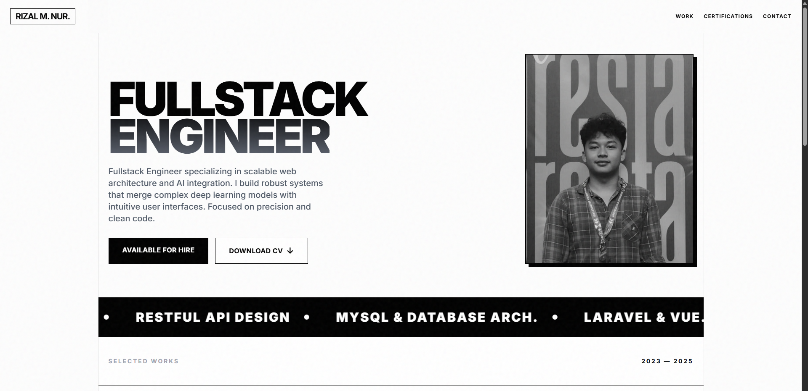

# ✦ Rizal M. Nur — Portfolio


> A high-performance, minimalist personal portfolio website engineered with **React** and **Tailwind CSS**. Designed with **Swiss Style** principles: focusing on typography, grid systems, and content clarity.

[](https://bxtohur.github.io/portofolio/)
[](https://reactjs.org/)
[](https://tailwindcss.com/)
[](https://vitejs.dev/)

## ✨ Key Features

* **Swiss / Brutalist Design:** Bold typography, high contrast, and grid-based layout.
* **Performance First:** Optimized images (WebP support), lazy loading, and minimal bundle size.
* **Dynamic Data:** All content is managed via a single `data.js` file for easy updates.
* **Interactive Modal:** Custom modal for viewing project details and certificates with image carousels.
* **PDF Viewer:** Integrated PDF handling for certificates without leaving the site.
* **Responsive:** Pixel-perfect adaptation for Mobile, Tablet, and Desktop.

## 🛠 Tech Stack

* **Framework:** React (Vite)
* **Styling:** Tailwind CSS
* **Deployment:** GitHub Pages
* **Icons:** Unicode & Custom SVG
* **Fonts:** Inter (Google Fonts)

## 🚀 Getting Started

To run this project locally on your machine:

1.  **Clone the repository**
    ```bash
    git clone [https://github.com/Bxtohur/portofolio.git](https://github.com/Bxtohur/portofolio.git)
    cd portofolio
    ```

2.  **Install Dependencies**
    ```bash
    npm install
    ```

3.  **Run Development Server**
    ```bash
    npm run dev
    ```
    Open `http://localhost:5173` to view it in the browser.

## 📂 Project Structure

```text
portofolio/
├── public/              # Static assets (Images, PDFs, Favicon)
│   ├── images/          # Project & Profile images
│   ├── certificates/    # PDF Certificates
│   └── files/           # CV / Resume PDF
├── src/
│   ├── data.js          # SINGLE SOURCE OF TRUTH (Edit content here)
│   ├── App.jsx          # Main Logic & UI Components
│   ├── index.css        # Tailwind directives & Custom CSS
│   └── main.jsx         # Entry point
├── vite.config.js       # Vite configuration
└── tailwind.config.js   # Tailwind configuration
